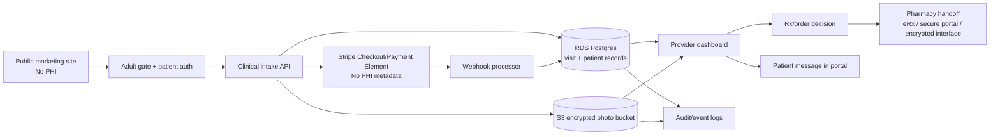

# Production Architecture Plan

Project: **Earl Is My Cat**  
Scope: 18+ cash-pay asynchronous teledermatology, supportive OTC/affiliate product recommendations, clinician-reviewed prescription workflows, and third-party compounding pharmacy handoff.

> This is an engineering and operations blueprint, not legal advice. HIPAA status, state telehealth requirements, pharmacy contracts, record-retention requirements, and advertising/claim language should be reviewed by counsel before launch.

---

## 1. Core architecture decision

The production system should be split into two environments:

| Surface | Domain example | PHI allowed? | Purpose |
|---|---:|---:|---|
| Marketing site | `earlismycat.com` | No | Public pages, conditions education, OTC/supportive product strategy, affiliate links. |
| Clinical app | `app.earlismycat.com` | Yes | Patient account, adult gate, intake, photos, consent, payment trigger, post-visit messaging. |
| Provider console | `provider.earlismycat.com` | Yes | One-page review dashboard, diagnosis, plan, Rx, pharmacy handoff, close consult. |
| Admin console | `admin.earlismycat.com` | Yes, limited | User management, refunds, support, audit review, vendor status. |

**Rule:** the public marketing site must never collect, store, log, or transmit PHI. Every workflow that collects symptoms, photos, diagnoses, prescriptions, or patient messages belongs in the clinical app.

---

## 2. Recommended production stack

### Preferred AWS HIPAA-grade path

Use AWS for the PHI app because the platform supports a Business Associate Addendum and a set of HIPAA-eligible services. This does not make the app compliant by itself; the app still needs correct configuration, vendor agreements, policies, and risk analysis.

| Layer | Recommended service | Notes |
|---|---|---|
| DNS/TLS | Route 53 + ACM | TLS everywhere. HSTS on app/provider domains. |
| Edge/security | CloudFront + AWS WAF | Block obvious abuse; no PHI in edge logs unless covered/retained properly. |
| Auth | Amazon Cognito or HIPAA-BAA auth vendor | Patient passwordless or email OTP; provider MFA required. |
| API | API Gateway + Lambda, or ECS/Fargate | Keep PHI APIs private behind auth. Lambda is simpler; ECS is easier for larger app logic. |
| Database | RDS PostgreSQL | Private subnet only, encrypted at rest, PITR backups, no public endpoint. |
| Object storage | S3 | Private buckets only, SSE-KMS, presigned upload/download, object key UUIDs. |
| Encryption | AWS KMS | Separate CMKs for DB, photos, logs/backups if possible. |
| Secrets | Secrets Manager | Database credentials, webhook secrets, pharmacy credentials. |
| Audit/logging | CloudTrail, CloudWatch, AWS Config | No PHI in logs. Audit access to PHI objects and visit records. |
| Threat monitoring | GuardDuty + Security Hub | Alerts to owner/operator. |
| Queue/events | SQS/EventBridge | Payment webhooks, photo processing, pharmacy handoff status. |
| Email | SES, or HIPAA-capable email vendor | Do not include PHI in email subject/body. Use portal links. |
| SMS | Avoid initially | If used, use only non-PHI operational messages unless BAA and policy permit. |

### Alternative vendor-accelerated path

A HIPAA-focused platform or EHR/telehealth vendor may reduce engineering scope if it signs a BAA and supports custom intake, photo storage, provider review, e-prescribing, and pharmacy workflow. Evaluate vendor lock-in, data export, audit log quality, pharmacy integration, and ability to keep Rx/OTC/ecommerce flows separate.

---

## 3. System boundary diagram

---

## 4. Data classification

| Data type | PHI? | Store where | Notes |
|---|---:|---|---|
| Name, DOB, state, phone, email tied to visit | Yes | RDS | Needed for identity, licensure, prescription. |
| Intake answers | Yes | RDS JSONB snapshot | Keep concise but complete enough for clinical decision-making. |
| Photos | Yes | S3 encrypted bucket | UUID object keys, short-lived signed URLs, no public access. |
| Diagnosis/plan/Rx | Yes | RDS | Part of medical record. |
| Pharmacy handoff payload | Yes | RDS + secure handoff channel | Store sent payload and status history. |
| Payment status | Usually linked to care | RDS; Stripe minimal metadata | Keep clinical details out of Stripe. |
| Public product catalog | No | Static JSON | No patient-specific data. |
| Audit log | Sensitive/PHI-adjacent | Append-only audit table + logs | Do not store unnecessary clinical text in logs. |

---

## 5. High-level production workflow

1. **Adult eligibility gate**
   - DOB and age confirmation before any photo upload.
   - If under 18: hard stop with neutral message.

2. **Account creation/authentication**
   - Patient creates or resumes a visit via authenticated session.
   - Provider dashboard uses MFA and role-based access.

3. **Intake and photo upload**
   - Minimal intake answers.
   - Three-photo standard: overview, medium, close-up.
   - Direct-to-S3 upload through presigned POST.

4. **Consent**
   - Telehealth consent, financial policy, no-insurance policy, Rx-not-guaranteed language, photo consent, pharmacy disclosure.
   - Store consent version, timestamp, IP/user agent, and user ID.

5. **Payment**
   - Create a Stripe Checkout Session / Payment Element for a generic online dermatology visit.
   - Never place diagnosis, condition, prescription, pharmacy details, photos, or free-text symptoms in Stripe metadata, descriptions, invoice text, receipt text, or product names.
   - Stripe webhook marks visit as paid/submitted.

6. **Provider review**
   - One-page bundle: patient header, photos, intake, red flags, formulary assistant, diagnosis, plan, Rx, patient message.
   - Provider selects: close with plan, send Rx, ask for more info, refer/urgent, no treatment, refund.

7. **Compounding pharmacy handoff**
   - Use e-prescribing or pharmacy-secure portal initially.
   - Store pharmacy ID, sent payload, handoff status, pharmacist clarifications, fill/shipping status if available.

8. **Patient notification**
   - Send portal notification with no PHI in email/SMS body.
   - Patient reads message and pharmacy instructions in authenticated portal.

9. **Close consult**
   - Store final diagnosis, plan, Rx/no-Rx decision, pharmacy status, patient message, and closure timestamp.
   - Lock final note after a configurable amendment window.

---

## 6. Production non-negotiables

| Area | Requirement |
|---|---|
| PHI hosting | PHI only on vendors covered by BAA or equivalent healthcare agreement. |
| Encryption | TLS in transit, KMS encryption at rest, encrypted backups. |
| Photos | Private object storage only; no CDN-public photo URLs. |
| Auth | Provider MFA required; patient sessions time-limited. |
| Logs | No PHI in application logs, analytics, Sentry-style tools, Stripe metadata, or URL query params. |
| Audit | Log every provider/admin read/write of PHI. |
| State licensure | Capture patient state/location before provider review; block unsupported states. |
| Payment | Card data handled by Stripe-hosted UI; app stores payment status only. |
| Pharmacy | No unencrypted email. Use eRx/secure portal/API with agreement. |
| Backups | Tested restore process, encrypted backups, defined retention. |
| Incident response | Written breach/security-incident runbook before launch. |

---

## 7. Launch phases

### Phase 0 — Static prototype complete

Current state: public pages, intake prototype, provider dashboard prototype, formulary/product strategy docs.

### Phase 1 — Production MVP

- Adult-only clinical app.
- Patient auth.
- Secure intake/photo upload.
- Consent/payment.
- Provider dashboard.
- Manual pharmacy handoff through secure pharmacy portal/eRx.
- Manual refunds in Stripe dashboard.
- Audit logs and backups.

### Phase 2 — Operational hardening

- Pharmacy status sync.
- Structured patient portal messages.
- Provider note templates.
- Advanced audit reporting.
- Support/admin workflow.
- SLA and incident-response drill.

### Phase 3 — Automation

- Condition-specific intake branching.
- Automated eligibility triage.
- Pharmacy API integration, if available and contracted.
- Product recommendation personalization after visit closure.
- Data export/reporting.

---

## 8. Key open decisions

| Decision | Recommended default |
|---|---|
| Hosting | AWS with BAA for PHI app. Static marketing may remain on non-PHI static hosting. |
| Auth vendor | Cognito first, unless an EHR/telehealth vendor handles portal auth. |
| Payment timing | Consent → payment → submit. Refund if not clinically appropriate. |
| Pharmacy integration | Start with secure portal/eRx; API later. |
| Data model style | Structured top-level visit fields + JSONB intake snapshot. |
| Patient messaging | Authenticated portal only; email/SMS says “You have a message.” |
| Analytics | Public site only; no third-party analytics on PHI app unless BAA and no PHI leakage. |
| AI use | No AI over PHI until vendor BAA, model/data retention review, and audit controls are complete. |
