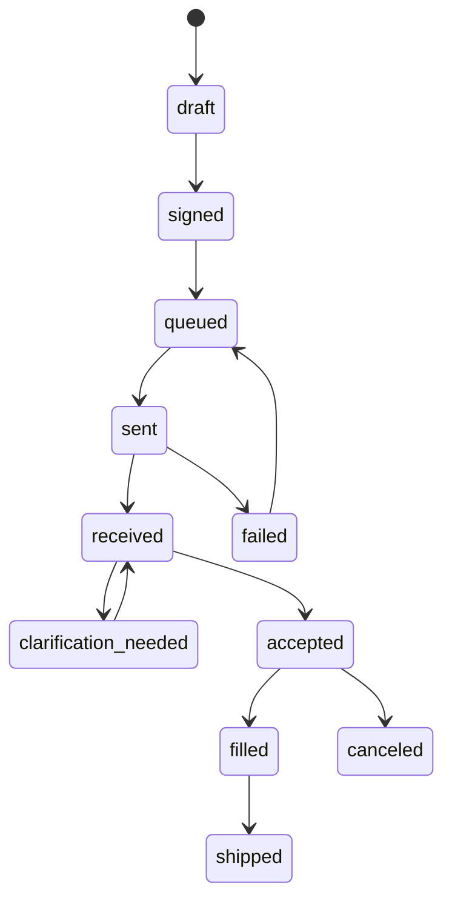

# Compounding Pharmacy Handoff — Production Plan

Goal: send prescriptions to a third-party pharmacy in a compliant, auditable, patient-specific workflow without making prescriptions look like ecommerce products.

---

## 1. Operating principle

Compounded prescriptions should be generated only after:

1. A valid adult patient visit exists.
2. Provider reviews intake/photos.
3. Provider documents diagnosis/assessment.
4. Provider determines a prescription is medically appropriate.
5. Provider signs the prescription.
6. The handoff uses an approved secure channel.

No patient-facing page should present a compounded medication as a direct-to-cart product.

---

## 2. Handoff methods

| Method | MVP use | Notes |
|---|---:|---|
| Pharmacy secure portal | Recommended MVP | Lowest engineering burden. Provider/staff enters Rx manually; store reference/status. |
| eRx vendor | Recommended if available | Best for auditability and pharmacy acceptance. Confirm controlled/non-controlled needs. |
| Encrypted API | Later | Requires contract, technical spec, authentication, and testing. |
| Secure fax | Fallback only | Use HIPAA-capable fax workflow; avoid email attachments. |
| Ordinary email | No | Do not send PHI/Rx by ordinary email. |

---

## 3. Pharmacy partner vetting checklist

Before routing prescriptions:

- Pharmacy legal name, NPI/NCPDP if applicable, license numbers.
- States where pharmacy may dispense/ship.
- 503A state-licensed pharmacy vs 503B outsourcing facility status.
- Whether patient-specific prescriptions are required for planned workflow.
- USP <795>/<797>/<800> policies as relevant.
- API/bulk ingredient COA sourcing process.
- Recall process and patient/provider notification process.
- Adverse event/product-quality complaint process.
- Labeling language for compounded medications.
- Pharmacist counseling process.
- Shipping carrier and temperature-control process if needed.
- Payment collection workflow: patient pays pharmacy directly vs included in visit/product fee.
- Data exchange agreement / BAA / treatment disclosure analysis reviewed by counsel.
- Clarification workflow and response time.
- Discontinuation/transition process if pharmacy partnership ends.

---

## 4. Minimum Rx payload

```json
{
  "patient": {
    "legal_name": "...",
    "date_of_birth": "YYYY-MM-DD",
    "phone": "...",
    "email": "...",
    "shipping_address": {}
  },
  "prescriber": {
    "name": "Auston Eckert, MD",
    "npi": "...",
    "license_state": "...",
    "license_number": "...",
    "clinic_contact": "..."
  },
  "clinical": {
    "diagnosis": "...",
    "allergies": [],
    "medications": [],
    "pregnancy_breastfeeding_status": "not_applicable|negative|positive|unknown",
    "relevant_notes": "minimum necessary"
  },
  "prescription": {
    "is_compounded": true,
    "formulation": "...",
    "vehicle": "...",
    "sig": "...",
    "quantity": "...",
    "refills": 0,
    "substitution_allowed": false,
    "compounding_rationale": "..."
  },
  "visit_reference": "visit_opaque_id"
}
```

---

## 5. Compounding rationale examples

Use structured options plus free text:

- `combination_to_reduce_regimen_complexity`
- `dose_strength_not_commercially_available`
- `vehicle_needed_for_tolerability`
- `allergy_or_excipient_avoidance`
- `commercial_product_not_medically_appropriate`
- `other_patient_specific_need`

Do not default every Rx to compounded. Document why the compounded version is appropriate for that specific patient.

---

## 6. Handoff status model



---

## 7. Patient-facing pharmacy language

Suggested visit confirmation copy:

> If a prescription is medically appropriate, it may be sent to a licensed pharmacy. Some prescriptions may be compounded for an individual patient. Compounded medications are not FDA-approved and are not reviewed by FDA for safety, effectiveness, or quality before dispensing. The pharmacy may contact you about payment, counseling, shipping, and medication-specific questions.

---

## 8. Pharmacy clarification workflow

When pharmacy needs clarification:

1. Pharmacy sends secure clarification request.
2. Staff/provider logs request in `pharmacy_handoffs`.
3. Provider edits Rx or responds.
4. Updated Rx payload is sent.
5. Clarification history remains attached to visit.
6. Patient is messaged only if timing/payment/shipping changes.

---

## 9. Avoid these patterns

- Do not let patients select compounded Rx from a cart.
- Do not use product pages to advertise exact compounded formulas as purchasable products.
- Do not route unsupported states to a pharmacy.
- Do not allow pharmacy to substitute formula components without provider authorization.
- Do not email prescription details in plain text.
- Do not store pharmacy portal passwords in shared documents.
- Do not put Rx details in Stripe metadata.
