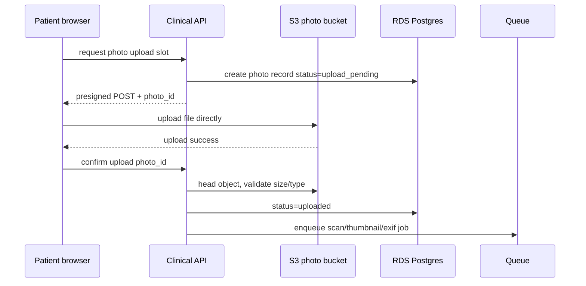

# Encrypted Photo Storage Plan

Patient-submitted photos are PHI when tied to a dermatology visit. Treat originals, thumbnails, metadata, and any derived image as PHI.

---

## 1. Storage design

| Item | Recommendation |
|---|---|
| Bucket | Dedicated private S3 bucket for clinical photos. |
| Public access | Block all public access. No public ACLs. |
| Object keys | UUID paths only, e.g. `visits/{visit_id}/photos/{photo_id}/original`. No names/DOB/condition. |
| Encryption | SSE-KMS with a dedicated customer-managed key. |
| Upload path | Browser uploads directly to S3 using presigned POST generated by backend. |
| Download path | Provider dashboard receives short-lived signed GET URL after authorization. |
| Metadata | Do not store patient name, diagnosis, or condition in S3 object metadata. |
| Lifecycle | Delete abandoned draft uploads after policy window, e.g. 7 days. Retain submitted visit photos per medical-record policy. |

---

## 2. Upload sequence

---

## 3. Photo processing

For each uploaded image:

1. Validate content type and extension.
2. Verify image can be decoded.
3. Enforce size limits, e.g. 15 MB/photo.
4. Generate display derivative with EXIF stripped.
5. Store derivative separately and encrypted.
6. Optionally retain original encrypted for medical-record integrity.
7. Compute SHA-256 hash for object integrity tracking.
8. Mark as `ready_for_review` only after checks pass.

---

## 4. Minimum patient photo request

Patient-facing copy:

> Three photos help the most: one overview, one medium-distance photo, and one close-up. Use good lighting and keep the image in focus. If you cannot safely or comfortably provide three photos, upload the clearest photos you can and tell us why.

The 3-photo standard is a workflow standard, not a universal legal rule.

---

## 5. Sensitive-location photo handling

Because the site is 18+ only:

- DOB gate must occur before photo upload.
- Adult confirmation must be stored before submission.
- Patient should be told not to include face/identifying body features unless necessary.
- UI should use neutral language such as “sensitive area” rather than explicit sexualized language.
- Provider access to sensitive photos must be audited.

---

## 6. Presigned URL policy

| URL type | Expiration | Notes |
|---|---:|---|
| Upload POST | 10 minutes | Single file only, content length restricted. |
| Provider image GET | 5 minutes | Generated only after provider authorization check. |
| Patient review GET | 5 minutes | Patient can view own submitted photos. |
| Pharmacy export | Avoid by default | Do not send photos to pharmacy unless necessary and authorized. |

---

## 7. Bucket policy rules

- Deny non-TLS requests.
- Deny unencrypted uploads.
- Deny wrong KMS key.
- Deny public ACLs.
- Deny cross-account access unless explicitly approved.
- Enable object-level logging where feasible.
- Enable versioning for submitted records if retention policy requires.

---

## 8. Redaction and display

- Provider dashboard should display EXIF-stripped derivative by default.
- Original file should be accessible only through an explicit “view original” action with audit reason.
- Photos should not be embedded in emails, PDFs, logs, analytics, or support tickets.
