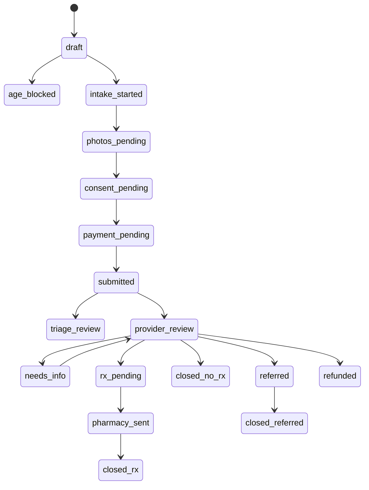

# Provider Dashboard Data Model

Goal: keep the dashboard one-page, high-signal, and clinically decisive while storing enough structured data for audit, prescriptions, pharmacy handoff, and record retention.

---

## 1. Provider review bundle

The provider dashboard should fetch one consolidated object:

```json
{
  "visit": {},
  "patient": {},
  "intake_summary": {},
  "photos": [],
  "red_flags": [],
  "consents": [],
  "payment": {},
  "formulary_options": [],
  "prior_messages": [],
  "pharmacy_handoff": {},
  "audit_context": {}
}
```

This avoids many dashboard calls and supports a single-page review experience.

---

## 2. Core entities

### patients

Stores patient identity and contact fields.

| Field | Type | Notes |
|---|---|---|
| id | uuid | Internal ID. |
| legal_first_name | text | PHI. |
| legal_last_name | text | PHI. |
| date_of_birth | date | Adult gate; PHI. |
| email | text | PHI when tied to visit. |
| phone | text | Optional. |
| address_json | jsonb | Required for prescriptions if pharmacy needs it. |
| created_at | timestamp |  |
| updated_at | timestamp |  |

### visits

One consult request.

| Field | Type | Notes |
|---|---|---|
| id | uuid | Internal visit ID. |
| patient_id | uuid | FK. |
| status | enum | See status list below. |
| concern_slug | text | Use internal enum; avoid public Rx promises. |
| patient_state | text | Licensure check. |
| severity | text | mild, moderate, severe, unsure. |
| duration | text | Short structured answer. |
| chief_concern | text | Patient free text. PHI. |
| intake_snapshot | jsonb | Minimal one-object answer record. |
| red_flag_summary | jsonb | Structured flags and reasons. |
| submitted_at | timestamp | After consent/payment. |
| assigned_provider_id | uuid | Nullable until assigned. |
| closed_at | timestamp |  |
| closure_reason | enum | rx_sent, no_rx, referred, more_info_unresolved, canceled. |

### visit_photos

| Field | Type | Notes |
|---|---|---|
| id | uuid | Internal photo ID. |
| visit_id | uuid | FK. |
| type | enum | overview, medium, closeup, other. |
| object_key_original | text | S3 key only. |
| object_key_display | text | EXIF-stripped derivative. |
| sha256 | text | Integrity. |
| status | enum | upload_pending, uploaded, processing, ready, rejected. |
| rejection_reason | text | e.g. unreadable, unsupported_file. |
| uploaded_at | timestamp |  |

### provider_decisions

| Field | Type | Notes |
|---|---|---|
| id | uuid | Internal decision ID. |
| visit_id | uuid | FK. |
| provider_id | uuid | FK. |
| diagnosis_text | text | Free-text dx; PHI. |
| diagnosis_codes | jsonb | Optional. |
| plan_text | text | Patient-specific plan. |
| rx_needed | boolean |  |
| rx_summary | text | Human-readable prescription decision. |
| safety_notes | text | Contraindications, red flags reviewed. |
| decision_status | enum | draft, signed, amended. |
| signed_at | timestamp | Required before Rx handoff. |

### prescriptions

| Field | Type | Notes |
|---|---|---|
| id | uuid | Internal Rx ID. |
| visit_id | uuid | FK. |
| provider_decision_id | uuid | FK. |
| medication_name | text | Commercial or compounded label. |
| is_compounded | boolean |  |
| formulation_text | text | PHI when tied to patient. |
| sig | text | Directions. |
| quantity | text |  |
| refills | integer |  |
| substitution_allowed | boolean |  |
| compounding_rationale | text | Required if compounded. |
| status | enum | draft, signed, sent, accepted, clarification, filled, canceled. |

### pharmacy_handoffs

| Field | Type | Notes |
|---|---|---|
| id | uuid | Internal handoff ID. |
| prescription_id | uuid | FK. |
| pharmacy_id | uuid | FK. |
| handoff_method | enum | e_rx, secure_portal, encrypted_api, secure_fax. |
| payload_hash | text | Do not log full payload in app logs. |
| status | enum | queued, sent, received, clarification, accepted, filled, shipped, failed. |
| sent_at | timestamp |  |
| external_reference | text | Pharmacy portal/order ID. |
| last_status_at | timestamp |  |

### patient_messages

| Field | Type | Notes |
|---|---|---|
| id | uuid | Internal ID. |
| visit_id | uuid | FK. |
| sender_type | enum | provider, system, patient. |
| body | text | PHI. Portal only. |
| visibility | enum | patient, internal. |
| sent_at | timestamp |  |
| read_at | timestamp | Nullable. |

### audit_events

Append-only event log.

| Field | Type | Notes |
|---|---|---|
| id | uuid |  |
| actor_id | uuid | User/system. |
| actor_role | text | patient/provider/admin/system. |
| patient_id | uuid | Nullable for non-patient events. |
| visit_id | uuid | Nullable. |
| event_type | text | `visit.viewed`, `photo.viewed`, etc. |
| reason | text | treatment, support, break_glass, system. |
| metadata | jsonb | No clinical free text. |
| ip_address | inet |  |
| user_agent | text |  |
| occurred_at | timestamp |  |

---

## 3. Visit status machine



---

## 4. Dashboard layout

One page, top to bottom:

1. Header: patient age/state/condition/status/payment.
2. Red flags: prominent banner if any.
3. Photos: grid with overview/medium/close-up.
4. Intake summary: short cards, not a long form.
5. Formulary assistant: condition-specific templates and exclusions.
6. Decision panel: diagnosis, plan, Rx, patient message.
7. Actions: send Rx + close, close no Rx, ask for more info, refer/urgent, refund.
8. Audit footer: last viewed, signed note, pharmacy status.

---

## 5. Provider sign-off requirements

Before closing as Rx:

- Provider verified patient is 18+.
- Provider verified patient state is supported/licensed.
- Photos are adequate or insufficiency is documented.
- Red flags reviewed.
- Diagnosis and plan entered.
- Rx reviewed manually.
- Compounding rationale entered if compounded.
- Patient message generated/reviewed.
- Pharmacy selected.
- Final action signed with timestamp.

---

## 6. “Ask for more info” workflow

Provider should be able to send a concise request without closing:

- Need clearer photos.
- Need medication/allergy clarification.
- Need pregnancy/breastfeeding clarification.
- Need state/location confirmation.
- Need urgent/in-person referral due to red flag.

If patient does not respond by configured deadline, move to `more_info_unresolved` with refund/partial refund decision.
