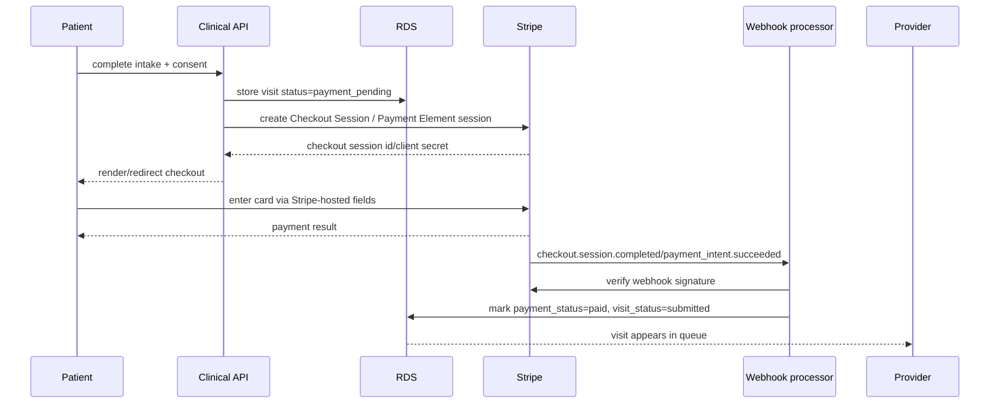

# Stripe Payment Sequence

Goal: collect cash-pay visit payment without putting PHI into Stripe.

---

## 1. Payment boundary

Stripe should receive only the minimum payment information needed to process the transaction. Do **not** put clinical information into Stripe metadata, product descriptions, receipt text, invoice memo, or customer notes.

### Allowed in Stripe

- Opaque internal order ID, e.g. `visit_order_8f6...`
- Generic product name: `Online dermatology visit`
- Price
- Customer email if needed for receipt/accounting
- Refund status

### Not allowed in Stripe

- Condition name, e.g. acne, herpes, genital warts
- Diagnosis
- Symptoms
- Prescription names or compounded formulas
- Pharmacy names tied to patient care
- Photo URLs
- Free-text intake answers
- DOB
- Patient message text

---

## 2. Recommended checkout flow

---

## 3. Payment timing options

| Option | Recommendation | Pros | Cons |
|---|---|---|---|
| Charge at submission | Recommended MVP | Simple, patient understands cost before review. | Refund needed if not appropriate. |
| Preauthorize then capture | Later | Useful if rejecting many visits. | Authorization expiry and operational complexity. |
| Charge after provider review | Later | Less refund volume. | More abandoned visits and delayed workflow. |

MVP default: **charge at submission**, then refund if the consult cannot be completed or the patient is outside scope.

---

## 4. Stripe account setup notes

- Telehealth and prescription-related workflows may require Stripe review/additional due diligence.
- Keep pharmacy/prescription sales separate from consultation payments unless Stripe explicitly approves the model.
- Do not process prescription drug purchase payments through the clinical consult product unless legal/payment review confirms the structure.
- Use Stripe-hosted components or Checkout/Payment Element so raw card data never touches the clinical app.
- Webhook endpoint must verify Stripe signatures.
- Store only Stripe IDs and payment status in your database.

---

## 5. Database records

`payments`

| Field | Type | Notes |
|---|---|---|
| id | uuid | Internal payment row. |
| visit_id | uuid | Internal visit. |
| stripe_checkout_session_id | text | Not PHI by itself but protect. |
| stripe_payment_intent_id | text | Store for reconciliation/refund. |
| amount_cents | integer | Visit fee. |
| currency | text | `usd`. |
| status | enum | pending, paid, failed, refunded, partial_refund. |
| paid_at | timestamp | Webhook-confirmed. |
| refunded_at | timestamp | If applicable. |
| refund_reason | text | Use coded reasons, avoid clinical free text. |
| created_at | timestamp |  |
| updated_at | timestamp |  |

---

## 6. Refund decision codes

Use structured reasons:

- `out_of_scope`
- `unsupported_state`
- `urgent_or_in_person_needed`
- `insufficient_information`
- `patient_cancelled_before_review`
- `duplicate_visit`
- `operational_error`

Avoid detailed diagnosis in refund notes.

---

## 7. Receipt copy

Recommended receipt line item:

> Online dermatology visit

Avoid:

- “Herpes treatment”
- “Genital wart consult”
- “Compounded tretinoin formula”
- “Aphthous ulcer prescription”

---

## 8. Testing checklist

- Webhook signature verification.
- Duplicate webhook idempotency.
- Failed payment does not submit visit.
- Refunded visit remains in medical record but payment status updates.
- No PHI in Stripe dashboard transaction details.
- No PHI in Stripe logs from API calls.
- Test card flow and 3DS flow.
